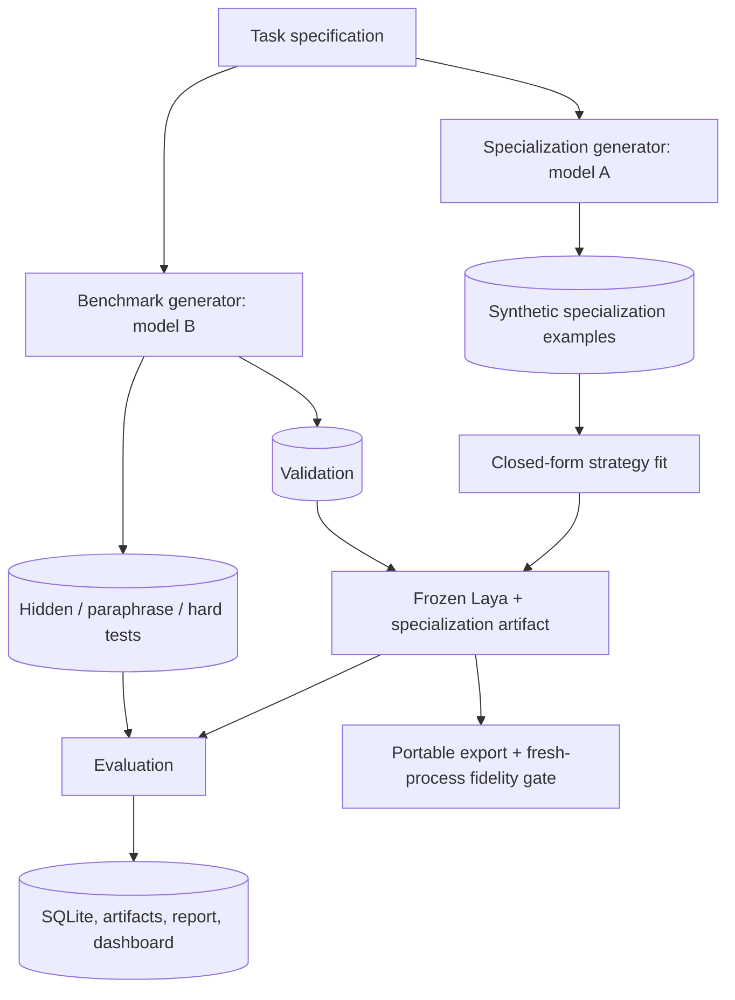

# Laya Steering Lab

`laya-steering-lab` is a reproducible research framework for testing whether a frozen
[Laya](https://github.com/NandhaKishorM/laya) decision model can be specialized to new domains
without backpropagation or weight fine-tuning. It compares Laya's original typed decision head to
prompt changes, embedding-space classifiers and transforms, and—where the runtime safely permits
it—actual hidden-state intervention.

This is an experiment harness, not a claim that steering works. Negative and unstable results are
retained alongside positive ones.

## What is implemented

- Strict Pydantic task and example schemas; generated content is treated only as data.
- Logically isolated specialization and benchmark generation, with separate providers/models,
  prompts, seeds, and content-addressed response caches.
- Cross-split duplicate-ID, normalized-text, and content-hash leakage rejection.
- Frozen PyTorch Laya, native Apple Silicon `laya-mlx`, and deterministic fake-test backends.
- Baseline, prompt-only, mean/medoid/nearest/top-k prototypes, contrastive vectors, multiclass
  centroids, whitened prototypes, closed-form residual transforms, true PyTorch activation
  steering, multiple semantic vectors, and pairwise Copeland ranking.
- Accuracy, balanced accuracy, macro/per-class F1, precision and recall, Brier score, ECE, log loss,
  specialization cost, cold load, warm latency, batch latency, throughput, and peak memory.
- Option-order, paraphrase, generator-style, irrelevant-noise, and domain-holdout reporting.
- Repeated seeds, task-level paired deltas, mean, sample deviation, 95% CI, seeded bootstrap CI,
  and win/tie/loss counts.
- SQLite experiment index, immutable JSON/JSONL/YAML artifacts, a guided local Studio, and a
  versioned SafeTensors export with fresh-process fidelity validation.

## Architecture and leakage boundary



The benchmark prompt never receives specialization examples. Validation can select a scalar
strength, but hidden, paraphrase, and hard examples never reach `fit`. Every row receives a hash of
normalized text, and suite loading fails if it appears in another split. The specialization model
and benchmark model may be entirely different. When they are the same, prompts and seed ranges
remain isolated. Raw provider responses are cached so a suite can be replayed without an API.

See [the technical design](docs/design.md) for inspected API versions and implementation boundaries.

## Install

```bash
python -m venv .venv
source .venv/bin/activate
pip install -e '.[dev]'
```

For exact known-good dependency versions, add `-c requirements/constraints.txt` to the install.

PyTorch Laya:

```bash
pip install -e '.[pytorch]'
export LAYA_LAB_BACKEND=pytorch
export LAYA_LAB_MODEL=convaiinnovations/laya
```

Apple Silicon (macOS 14+, Python 3.11+):

```bash
pip install -e '.[mlx]'
export LAYA_LAB_BACKEND=mlx
export LAYA_LAB_MODEL=aac6fef/laya-mlx
```

The current MLX public API does not expose a safe intermediate-state hook, so
`activation_steering` is recorded as unsupported there. Embedding strategies reuse the loaded MLX
encoder. The PyTorch adapter freezes all parameters and installs a temporary encoder-layer forward
hook for true activation steering.

Copy `.env.example` to `.env`, export the values in your shell, or use your preferred secret
manager. `.env` is ignored by Git. Keys are never stored in suite metadata or committed files.

## Quick start

Generate unrelated task families. Model A creates specialization data; model B independently
creates validation and hidden data:

```bash
export LAYA_LAB_LLM_API_KEY=...
export LAYA_LAB_SPECIALIZATION_MODEL=model-a
export LAYA_LAB_BENCHMARK_MODEL=model-b

laya-lab generate \
  --domains 10 --tasks-per-domain 5 \
  --specialization-examples 40 --test-examples 300 \
  --style-control-model model-c \
  --repetitions 3 --seed 100 --output benchmarks/research
```

`--style-control-model` adds an independently prompted hidden stratum for the same tasks. Reports
show accuracy by `source_style` and the cross-style spread instead of conflating it with accuracy.

Run all methods on exactly the same suite. Unsupported method/task combinations become explicit
skip artifacts:

```bash
laya-lab benchmark \
  --suite benchmarks/research/seed-100 \
  --methods baseline,prompt_only,nearest_prototype,contrastive_vector,multiclass_centroids,whitened_prototypes,residual_embedding_transform,activation_steering,multi_vector_steering,pairwise_ranking \
  --seeds 11,22,33
```

On PyTorch, use names such as `activation_steering@0`, `activation_steering@11`, and
`activation_steering@-1` to compare encoder layers. Each strength is selected on validation only.

### Guided Studio

The simplest workflow is the local interface:

```bash
laya-lab serve
```

Open `http://127.0.0.1:8787`, then:

1. describe the desired behavior in natural language;
2. connect OpenRouter, OpenAI, or another OpenAI-compatible endpoint and choose its model;
3. review and edit the inferred policy and labels;
4. generate independently prompted specialization, validation, hidden, paraphrase, and hard data;
5. edit individual examples and labels without touching JSON;
6. compare selected methods on real frozen Laya and download the best fidelity-checked artifact.

API keys are never written to the experiment store, generated suite, logs, or browser local
storage. By default they stay in process memory. The connection form also offers an explicit
**Save this connection to `.env`** option; the server writes the local, Git-ignored file with
restrictive permissions and never sends the saved key back to the browser. A separate benchmark
endpoint/model can be configured in the policy step.

For scripted workflows, inspect paired statistics and a held-out domain:

```bash
laya-lab report RUN_ID --bootstrap-samples 10000
laya-lab report RUN_ID --holdout-domain smart_home
laya-lab compare RUN_A RUN_B
```

## One-off specialization

```bash
laya-lab specialize \
  --task "Prioritize technical support tickets" \
  --labels URGENT,NORMAL,IGNORE \
  --examples 50 --method multi_vector_steering \
  --output exports/support-priority-laya
```

For a reviewed policy, use `--task-file task.yaml`. The command obtains validation examples from
the independent benchmark provider, fits without gradients, exports, starts a fresh Python process,
reloads deterministic probes, and rejects the export if labels or probabilities drift.

## Embedding classification is not activation steering

| Category | Final decision component | What changes |
|---|---|---|
| baseline / prompt-only | Laya decision head | nothing, or instructions only |
| prototypes / centroids / contrastive / whitening / residual / multi-vector | external embedding classifier | geometry over mean-pooled Laya encoder outputs |
| activation steering | Laya decision head | intermediate encoder state gets `h + alpha*v` |
| pairwise ranking | repeated Laya decision head + Copeland | decomposition and deterministic aggregation |

Prototype classification is never described as internal Laya steering. Residual transforms are
small explicit matrices derived by ridge linear algebra. No strategy calls an optimizer or
`backward`, and Laya parameters have `requires_grad=False` in the PyTorch backend.

## Portable exports

A lightweight export references the base model and contains only specialization state:

```text
support-priority-laya/
├── manifest.json
├── specialization.json
├── vectors.safetensors
├── processor.json
├── fidelity.json
└── README.md
```

Load it with minimal application changes:

```python
from laya_steering import SpecializedLaya

agent = SpecializedLaya.from_pretrained("./exports/support-priority-laya")
result = agent.predict("Production is down for every customer")
# agent.system_one(...) is the same entry point
```

Export a specialization retained by a benchmark run:

```bash
laya-lab export 'RUN_ID:TASK_NAME:STRATEGY' --output exports/my-laya
laya-lab export 'RUN_ID:TASK_NAME:STRATEGY' --output exports/portable --self-contained
```

`--self-contained` accepts only a resolved local checkpoint directory and copies it into the bundle;
it does not silently download or duplicate remote weights. The manifest carries license and
attribution fields. Verify redistribution is allowed by the checkpoint's license.

## Reproducing and extending experiments

Suites are ordinary files. Re-run without contacting the LLM:

```bash
laya-lab benchmark --suite benchmarks/my-suite --backend pytorch --seed 42
```

SQLite records the model identifier/revision when available, backend, task, suite, parameters,
metrics, timings, seeds, environment and Git commit. The adjacent run directory retains
specialization matrices and skips. Use multiple generated suites and repeated seeds; a single
improved task is not evidence of a general effect.

To add a strategy, subclass `Strategy` in `src/laya_steering/strategies.py`, implement `fit`, declare
the final `decision_component`, return JSON metadata plus named arrays, register its CLI name, and
add export/reload fidelity coverage. `fit` must not accept a hidden split.

To add an LLM provider, implement `LLMProvider.generate_json` in
`src/laya_steering/providers.py`. Preserve strict JSON validation, raw-response caching,
provider/model/seed provenance, and the specialization/benchmark boundary. Never execute output.

To add a Laya runtime, implement `LayaBackend` in `src/laya_steering/backends.py`. Batch embeddings
and decisions wherever possible. Only advertise activation steering if a stable, inspectable
intervention before the original decision head exists.

## Checked-in smoke experiment

`benchmarks/smoke` contains ten human-authored fixture tasks across five domains. It exists for CI
and plumbing—not as scientific evidence. A real run was executed locally with the deterministic
fake backend because neither `laya`/weights nor `laya-mlx` was installed. Results are preserved in
`experiments/` under run `20260925T072549Z-5726025d`; `experiments/smoke-report.json` contains 81
task/strategy results. Activation steering was correctly skipped, and contrastive vectors ran only
on the binary task. Do not interpret fake-backend scores as evidence about Laya.

Run the missing real-checkpoint experiment exactly with:

```bash
pip install -e '.[pytorch]'
laya-lab benchmark --suite benchmarks/smoke --backend pytorch \
  --model convaiinnovations/laya --seed 17
```

On Apple Silicon:

```bash
pip install -e '.[mlx]'
laya-lab benchmark --suite benchmarks/smoke --backend mlx \
  --model aac6fef/laya-mlx --seed 17
```

## Scientific limitations

- Laya's encoder was not trained as a universal bi-encoder; cosine geometry may be weak even when
  the typed decision head is good.
- A pooled sentence direction is dimensionally valid at an encoder layer but not guaranteed to be
  a causal concept direction.
- Provider seeds may be advisory. Cached artifacts, not regenerated text, are the reproducibility
  boundary.
- Validation selection can overfit small synthetic sets. Use independent generations, domain
  holdouts, paired intervals and generator-style strata.
- Normal confidence intervals are approximate for few tasks; prefer bootstrap output and inspect
  task-level wins/ties/losses.
- `ru_maxrss` is process-level peak memory and can overstate incremental strategy memory.
- Self-contained checkpoint redistribution remains subject to upstream licensing.

## Tests

```bash
pytest
ruff check src tests scripts
```

Fast tests use the fake backend and cover leakage protection, deterministic SafeTensors,
prototype/contrastive math, metrics, option permutations, artifact versioning, fresh-process export
fidelity, backend contracts, LLM validation and malformed suites. Mark tests requiring downloaded
weights with `@pytest.mark.integration`.
