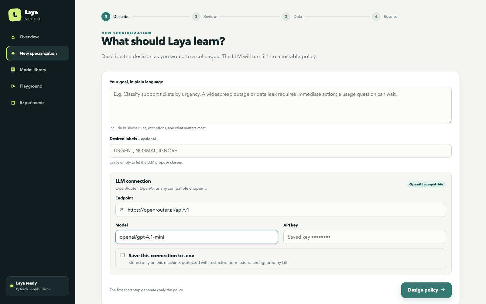
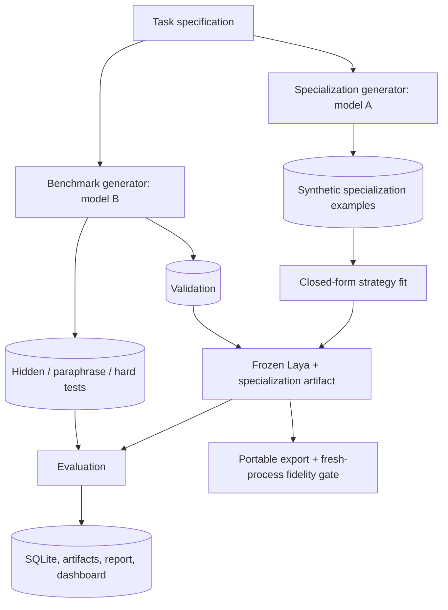

# Laya Studio

> **Before fine-tuning Laya, try specializing its representation space.**

Laya Studio helps you specialize a frozen [Laya](https://github.com/NandhaKishorM/laya) model for
a new domain or decision task—without gradients, without changing its weights, and without
maintaining another full model checkpoint.

Describe the behavior you want in natural language. Laya Studio generates synthetic examples,
derives lightweight specialization geometry from Laya's existing representations, benchmarks
multiple approaches against vanilla Laya on independent test data, and exports the best result as
a small portable artifact.

The intuition is simple: **the model may already contain enough information for your task. Sometimes
you do not need to teach it again—you need a better way to read the representation it already
learned.**



## From a task description to a specialized Laya

Suppose vanilla Laya needs to classify support tickets as `CRITICAL`, `NORMAL`, or `IGNORE`.
Laya Studio can:

1. turn that requirement into an explicit, editable decision policy;
2. generate diverse labeled examples for specialization;
3. derive centroids, contrastive directions, transforms, or steering vectors from those examples;
4. test every method against vanilla Laya on independently generated held-out cases;
5. let you inspect edge cases and paraphrases in the Playground;
6. export the winning specialization and reload it in another application.

```text
Traditional fine-tuning
task → dataset → gradient training → another model checkpoint

Laya Studio
task → synthetic examples → representation specialization → small portable artifact
```

The base checkpoint remains frozen and reusable. One Laya installation can support many independent
specializations without duplicating its weights.

## Why try this before fine-tuning?

Our experiments show that changing how Laya's embedding or representation space is interpreted can
produce substantial improvements on some classification, routing, prioritization, ranking, and
domain-decision tasks. It does not work universally—and Laya Studio is deliberately built to tell
you when it does not—but it works often enough that it is worth testing before training new weights.

| | Laya Studio representation specialization | Fine-tuning |
|---|---|---|
| Training gradients | None | Required |
| Base weights modified | No; Laya stays frozen | Yes, directly or through adapters |
| Artifact | Task vectors, centroids, or small matrices | New checkpoint or adapter weights |
| Iteration speed | Fit and compare lightweight methods quickly | Train, validate, and manage checkpoints |
| One base model, many tasks | Yes; specializations share one checkpoint | Usually one adapter/checkpoint per specialization |
| Compute | Designed for local experimentation, including Apple Silicon | Often benefits from substantial accelerator memory |
| Best suited for | Classification, routing, ranking, prioritization, domain decisions | Behaviors that lighter methods cannot capture reliably |

If representation-space specialization reaches the quality and robustness your task needs,
fine-tuning becomes unnecessary for that task. If it does not, the experiment gives you evidence
that training is justified rather than assumed.

Practical advantages include fast iteration, tiny artifacts relative to full checkpoints, simple
rollback, direct comparison with baseline Laya, and a much lower barrier to trying several task
definitions on a laptop. No optimizer or backward pass is used, and the original model remains
available for every other specialization.

If you find the idea useful, consider starring the repository—it helps more people discover and
test the approach.

<a href="https://www.buymeacoffee.com/Hantlowt"></a>

## What Laya Studio tests

Laya's encoder may already organize task-relevant information in its latent space. Laya Studio
tests whether simple, inspectable geometry can exploit that organization:

- **Prompt-only:** improve the task formulation without changing representation geometry.
- **Prototypes and centroids:** classify by similarity to labeled regions of Laya's own embedding
  space, using means, medoids, nearest examples, or top-k voting.
- **Contrastive vectors:** derive directions such as `mean(positive) - mean(negative)`.
- **Whitening and residual transforms:** center, whiten, or analytically transform embeddings with
  explicit, exportable statistics and small matrices.
- **Multi-vector methods:** represent a task through several semantic directions instead of one
  global axis.
- **Pairwise ranking:** decompose ranking decisions and aggregate deterministic comparisons.
- **Activation steering:** where the backend exposes a safe hook, inject a derived task vector into
  an intermediate representation before Laya's original decision head.

These methods are evaluated against the unchanged Laya baseline on exactly the same hidden data.
The framework reports accuracy, balanced accuracy, macro and per-class F1, precision, recall,
Brier score, ECE, log loss, latency, throughput, specialization cost, and peak memory. Robustness
checks cover option order, paraphrases, generator style, irrelevant noise, and domain holdouts.

Repeated seeds produce paired baseline differences, mean, standard deviation, 95% confidence
intervals, seeded bootstrap intervals, and task-level win/tie/loss counts. A method is not presented
as better because it happened to win one benchmark.

This remains an experiment harness, not a claim that representation specialization always works.
Negative, unsupported, and statistically unstable results are retained alongside positive ones.

## Install

```bash
python -m venv .venv
source .venv/bin/activate
pip install -e '.[dev]'
```

For exact known-good dependency versions, add `-c requirements/constraints.txt` to the install.

PyTorch Laya:

```bash
pip install -e '.[pytorch]'
export LAYA_LAB_BACKEND=pytorch
export LAYA_LAB_MODEL=convaiinnovations/laya
```

Apple Silicon (macOS 14+, Python 3.11+):

```bash
pip install -e '.[mlx]'
export LAYA_LAB_BACKEND=mlx
export LAYA_LAB_MODEL=aac6fef/laya-mlx
```

The current MLX public API does not expose a safe intermediate-state hook, so
`activation_steering` is recorded as unsupported there. Embedding strategies still reuse the
loaded MLX encoder. PyTorch freezes every parameter and provides a temporary encoder-layer hook
for true activation-steering experiments.

Copy `.env.example` to `.env`, export its values in your shell, or save the connection from the
Studio. `.env` is ignored by Git. API keys are never stored in suites, experiment metadata, logs,
or browser local storage.

## Quick start: guided Studio

```bash
laya-studio serve
```

Open `http://127.0.0.1:8787`, then:

1. describe the desired behavior in natural language;
2. connect OpenRouter, OpenAI, or another OpenAI-compatible endpoint;
3. review and edit the inferred policy and labels;
4. generate isolated specialization, validation, hidden, paraphrase, and hard datasets;
5. review individual examples without handling raw JSON;
6. select the methods to compare on real frozen Laya;
7. keep a default method, test modified examples in the Playground, and export the result.

The **Model library** gives each specialization a readable name and lets you keep, remove, compare,
or export individual methods. The separate **Playground** can load benchmark examples, alter their
wording without saving those edits, and run them through any retained method.

By default an API key remains only in process memory. The optional **Save this connection to
`.env`** control writes the local Git-ignored file with restrictive permissions and never sends the
saved secret back to the browser. A separate provider or model can generate the benchmark.

### One-off specialization

```bash
laya-studio specialize \
  --task "Prioritize technical support tickets" \
  --labels URGENT,NORMAL,IGNORE \
  --examples 50 --method multi_vector_steering \
  --output exports/support-priority-laya
```

For a reviewed policy, use `--task-file task.yaml`. The command obtains validation examples from
the independent benchmark provider, fits without gradients, exports, starts a fresh Python process,
reloads deterministic probes, and rejects the export if predictions or probabilities drift.

### Research suites

Model A can generate specialization data while model B independently generates validation and
hidden data:

```bash
export LAYA_LAB_LLM_API_KEY=...
export LAYA_LAB_SPECIALIZATION_MODEL=model-a
export LAYA_LAB_BENCHMARK_MODEL=model-b

laya-studio generate \
  --domains 10 --tasks-per-domain 5 \
  --specialization-examples 40 --test-examples 300 \
  --style-control-model model-c \
  --repetitions 3 --seed 100 --output benchmarks/research

laya-studio benchmark \
  --suite benchmarks/research/seed-100 \
  --methods baseline,prompt_only,nearest_prototype,contrastive_vector,multiclass_centroids,whitened_prototypes,residual_embedding_transform,activation_steering,multi_vector_steering,pairwise_ranking \
  --seeds 11,22,33
```

`--style-control-model` adds an independently prompted hidden stratum. Unsupported method/task
combinations produce explicit skip artifacts. On PyTorch, names such as `activation_steering@0`,
`activation_steering@11`, and `activation_steering@-1` compare encoder layers; strength is always
selected on validation data only.

Inspect paired statistics and held-out domains with:

```bash
laya-studio report RUN_ID --bootstrap-samples 10000
laya-studio report RUN_ID --holdout-domain smart_home
laya-studio compare RUN_A RUN_B
```

## Technical methodology



The benchmark prompt never receives specialization examples. Validation may select a scalar
strength, but hidden, paraphrase, and hard examples never reach `fit`. Every row receives a hash of
normalized text, and suite loading fails if the same content appears across protected splits.

The specialization and benchmark generators may use entirely different providers and models. If
they share a provider, their prompts and seed ranges remain isolated. Every raw response is cached,
so an experiment can be replayed without contacting the provider again. All generated output is
validated through strict Pydantic schemas and is treated as data, never executable code.

See [the technical design](docs/design.md) for inspected Laya APIs and backend boundaries.

## Embedding classification is not activation steering

| Category | Final decision component | What changes |
|---|---|---|
| baseline / prompt-only | Laya decision head | nothing, or instructions only |
| prototypes / centroids / contrastive / whitening / residual / multi-vector | external embedding classifier | geometry over mean-pooled Laya encoder outputs |
| activation steering | Laya decision head | intermediate encoder state receives `h + alpha*v` |
| pairwise ranking | repeated Laya decision head + Copeland | decomposition and deterministic aggregation |

Prototype classification is not described as internal Laya steering. It is interesting for a
different reason: it asks whether the encoder already exposes enough task structure to make a new
decision without retraining the model. Centroids, contrastive directions, whitening, residual
transforms, and multi-vector strategies are lightweight ways to test that geometry directly.

Residual transforms are explicit small matrices derived by ridge linear algebra. No strategy calls
an optimizer or `backward`, and all Laya parameters have `requires_grad=False` under PyTorch. True
activation steering is reported separately because it modifies an intermediate representation and
then uses Laya's original decision head.

## Portable exports

A lightweight export references the base model and stores only specialization state:

```text
support-priority-laya/
├── manifest.json
├── specialization.json
├── vectors.safetensors
├── processor.json
├── fidelity.json
└── README.md
```

```python
from laya_studio import SpecializedLaya

agent = SpecializedLaya.from_pretrained("./exports/support-priority-laya")
result = agent.predict("Production is down for every customer")
# agent.system_one(...) preserves the same entry point
```

Export a retained specialization:

```bash
laya-studio export 'RUN_ID:TASK_NAME:STRATEGY' --output exports/my-laya
laya-studio export 'RUN_ID:TASK_NAME:STRATEGY' --output exports/portable --self-contained
```

The default bundle does not duplicate base weights. `--self-contained` accepts a resolved local
checkpoint directory and copies it into the artifact; it never silently downloads weights. The
manifest records license and attribution metadata, but redistribution remains subject to the
upstream checkpoint's license.

Every export runs deterministic probes before serialization, reloads the artifact in a fresh
Python process, reruns those probes, and rejects the export if labels or probabilities differ
beyond tolerance.

## Reproducing and extending experiments

Suites are ordinary files and can be rerun without an LLM:

```bash
laya-studio benchmark --suite benchmarks/my-suite --backend pytorch --seed 42
```

SQLite records the model identifier and revision when available, backend, task, immutable suite,
strategy parameters, metrics, timings, seeds, environment, and Git commit. Adjacent run directories
retain specialization matrices and explicit skips. Experiment databases, generated datasets,
fitted vectors, and exports live under local Git-ignored directories; users own their results.

To add a strategy, subclass `Strategy` in `src/laya_studio/strategies.py`, implement `fit`, declare
the final `decision_component`, return JSON metadata plus named arrays, register its CLI name, and
add export/reload fidelity coverage. `fit` must not accept a hidden split.

To add an LLM provider, implement `LLMProvider.generate_json` in
`src/laya_studio/providers.py`. Preserve strict JSON validation, raw-response caching,
provider/model/seed provenance, and the specialization/benchmark boundary. Never execute output.

To add a runtime, implement `LayaBackend` in `src/laya_studio/backends.py`. Batch embeddings and
decisions wherever possible. Only advertise activation steering when a stable, inspectable hook
exists before the original decision head.

## Local smoke benchmark

`benchmarks/smoke` contains ten human-authored fixture tasks across five domains. It exists for CI
and plumbing, not as scientific evidence. Run it against a real checkpoint with:

```bash
pip install -e '.[pytorch]'
laya-studio benchmark --suite benchmarks/smoke --backend pytorch \
  --model convaiinnovations/laya --seed 17
```

On Apple Silicon:

```bash
pip install -e '.[mlx]'
laya-studio benchmark --suite benchmarks/smoke --backend mlx \
  --model aac6fef/laya-mlx --seed 17
```

## Scientific limitations

- Representation specialization does not universally replace fine-tuning. Some required behaviors
  will not be captured reliably by pooled embeddings, small transforms, or steering vectors.
- Laya's encoder was not trained as a universal bi-encoder; cosine geometry may be weak even when
  the typed decision head is strong.
- A pooled sentence direction is dimensionally valid at an encoder layer but is not guaranteed to
  be a causal concept direction.
- Synthetic examples can encode provider bias. Independent generation, style-control strata,
  domain holdouts, and human review reduce that risk but do not eliminate it.
- Provider seeds may be advisory. Cached artifacts, not regenerated text, are the reproducibility
  boundary.
- Validation selection can overfit small synthetic sets. Use independent generations, multiple
  seeds, paired intervals, generator-style strata, and held-out domains.
- Normal confidence intervals are approximate for few tasks; prefer bootstrap output and inspect
  task-level wins, ties, and losses.
- `ru_maxrss` is process-level peak memory and can overstate incremental strategy memory.
- Self-contained checkpoint redistribution remains subject to upstream licensing.

Fine-tuning remains appropriate when the behavior you need cannot be represented reliably through
these lighter-weight methods. Laya Studio's job is to make that boundary measurable.

## Tests

```bash
pytest
ruff check src tests scripts
```

Fast tests use the fake backend and cover leakage protection, deterministic SafeTensors,
prototype and contrastive mathematics, metrics, option permutations, artifact versioning,
fresh-process export fidelity, backend contracts, LLM-response validation, and malformed suites.
Mark tests requiring downloaded weights with `@pytest.mark.integration`.
