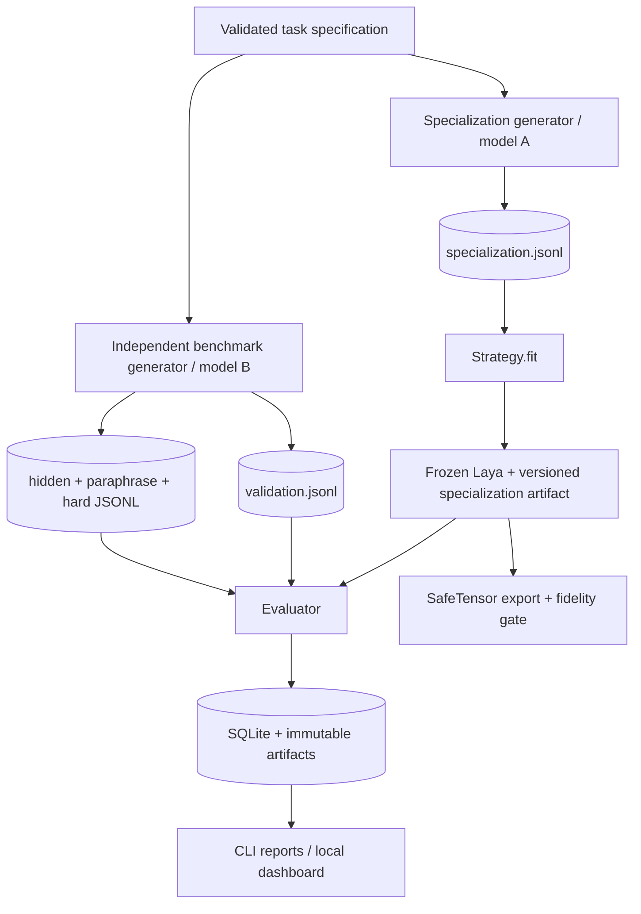

# Technical design

## Evidence from the current Laya implementations

This design was checked on 2026-09-25 against upstream Python commit
`970dc8c5f63d7b886a68409493f37d569424f933` (`laya` 0.3.20) and independent
MLX-port commit `0a859518634112655cb97c745dbf04f5191aaf13` (`laya-mlx` 0.2.0).

The Python API loads with `laya.load(model_id_or_path, device=...)`. `Agent.system_one`
and its alias `predict` accept a state plus keyed `choice`, `score`, or `noul` questions.
`Agent.predict_batch(states, questions, batch_size=...)` is the throughput path. The public
`laya.embed_fn_from_agent(agent)` mean-pools the already-loaded encoder, so no second embedding
model is needed.

The PyTorch model is an encoder followed by a question-type embedding, a small transformer
decision head, marker gathering, and a scorer. This makes an encoder-layer forward hook a real
hidden-state intervention before the original decision head. The lab only enables that path when
it can identify a supported layer container and always removes the hook after inference. It does
not mutate weights. Laya's public prediction hooks operate around an inference request and are not
hidden-state hooks.

The MLX port loads with `laya_mlx.load`, exposes `predict`/`system_one`, and supplies
`laya_mlx.embed_fn_from_agent`. Its current public API does not expose a stable intermediate
activation hook or batched-state API. The adapter batches embeddings, but performs decisions
sequentially; activation steering is deliberately reported unsupported rather than emulated.

## Boundaries

The generator writes each split separately and assigns every row a content hash. Loading a suite
fails on duplicate IDs, duplicate normalized text, or duplicate content hashes across
specialization, validation, hidden, paraphrase, and hard splits. Provider role, model, prompt hash,
seed, raw response cache key, and timestamp are retained. Benchmark prompts never contain the
specialization examples.

## Strategy contract

Every strategy has `fit(task, specialization, validation, backend)` and batched
`predict_proba(states)`. Hyperparameters are selected from specialization/validation only.
Strategies serialize plain JSON metadata and named numeric arrays. No strategy receives a test
split during fitting.

- `baseline` and `prompt_only` end in Laya's original typed decision head.
- prototype, centroid, contrastive, whitened, residual, and multi-vector methods end in an
  embedding-space classifier. Reports label them as such, never as internal steering.
- `activation_steering` injects a task vector into a real PyTorch encoder layer and then uses
  Laya's original decision head. Unsupported backends return a recorded skip.
- `pairwise_ranking` runs deterministic pairwise Laya choice questions and aggregates Copeland
  scores. Ties use original label order.

All base parameters are put in evaluation mode and `requires_grad=False` where exposed. Fitting is
closed-form/statistical: centroids, medoids, covariance whitening, ridge linear algebra, or vector
addition. There is no optimizer or backward pass.

## Evaluation and statistics

A run evaluates every enabled method on the same immutable dataset IDs. It stores accuracy,
balanced accuracy, macro and per-class F1/precision/recall, log loss, Brier score, ECE, warm and
batch latency, throughput, specialization cost, cold-load time, and peak memory when available.
Robustness modules cover option permutations, paraphrase consistency, generator-style strata,
irrelevant-noise injection, and domain holdout. Aggregate reports use paired task differences,
mean, sample standard deviation, 95% t/normal intervals, and win/tie/loss counts; bootstrap CIs are
seeded and optional.

## Artifact format

An export is a Hugging Face-style directory with `manifest.json`, `specialization.json`,
`vectors.safetensors`, `processor.json`, and `README.md`. Canonical JSON and sorted tensor names
make serialization deterministic. The lightweight artifact pins the base model and revision;
self-contained export copies only an explicitly resolved local checkpoint and carries license and
attribution metadata. A fresh Python process reloads deterministic probes before an export is
accepted. Pickle and generated code are never loaded or executed.

## Known limitations

Mean-pooled Laya embeddings were not trained as a universal bi-encoder, so prototype quality is an
empirical question. Encoder-layer vectors derived from pooled sentence embeddings are dimensionally
compatible but may not be causally aligned with token representations. MLX activation steering is
unavailable pending a stable hook. Provider seeds are advisory on APIs that do not guarantee
determinism. A fake backend supports fast CI and smoke experiments but is not scientific evidence
about Laya; real-checkpoint runs are marked separately.
